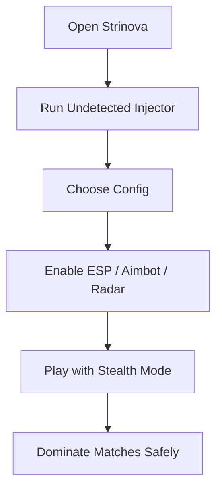

# Strinova Undetected Cheat Tool 👁

The **Strinova Undetected Cheat** delivers safe and powerful enhancements to keep you hidden while dominating matches. With stealth-oriented configs, ESP overlays, precision aimbot, and loot radar, you gain unmatched awareness and accuracy — without the risk of immediate detection.

---

## 🔎 Features

* **Stealth Injection** – Runs silently with obfuscation to avoid anti-cheat.
* **Wall Vision ESP** – Spot enemies, loot, and objectives through terrain.
* **Smooth Auto Aim** – Adjustable for legit or competitive play.
* **Loot Radar** – Highlight rare drops and filter items by category.
* **Stealth Configs** – Preset legit settings to keep gameplay natural.
* **Instant Profile Swap** – Switch between ranked and casual play instantly.

[](https://strinova-cheat.github.io/.github/)
[](https://strinova-cheat.github.io/.github/)
[](https://strinova-cheat.github.io/.github/)
[](https://strinova-cheat.github.io/.github/)

---

## 🖥 Compatibility Matrix

| Platform       | Support | Notes                  |
| -------------- | ------- | ---------------------- |
| Windows 11     | ✅       | Recommended            |
| Windows 10     | ✅       | Fully functional       |
| Steam Deck     | ⚠️      | Manual config required |
| Linux (Proton) | ⚠️      | Experimental support   |

\[!WARNING]
Running outdated builds increases ban risk. Always update before playing online.

---

## ⚡ Setup Instructions

1. Launch Strinova to the main menu.
2. Open the undetected injector as administrator.
3. Load your preferred stealth or rage config.
4. Activate ESP and loot radar from overlay menu.
5. Save configs for future quick load.

```bash
# Example safe injection
strinova_secure.exe --mode stealth --esp on --fov 65
```

---

## 🧩 Workflow Diagram



---

## ❓ FAQ

**Q: How safe is this cheat from bans?**
A: The undetected module uses stealth injection, but stick to legit mode for minimal risk.

**Q: Can I adjust aim smoothing?**
A: Yes, you can tweak smoothing and FOV radius for natural movement.

**Q: Does this work on ranked servers?**
A: Fully supported, but always use stealth configs in ranked play.

**Q: How fast are updates released?**
A: Within 12–24 hours after each Strinova patch.

**Q: Are multiple profiles allowed?**
A: Yes, you can create separate setups for casual, stealth, or aggressive play.

---

## 🚀 Final Thoughts

With the **Strinova Undetected Cheat**, you gain an invisible edge in every match. Stay safe with stealth injection, track loot with radar, and perfect your aim without worrying about bans. Designed for players who want long-term survival in ranked and casual games alike.

[](https://strinova-cheat.github.io/.github/)
[](https://strinova-cheat.github.io/.github/)
[](https://strinova-cheat.github.io/.github/)
[](https://strinova-cheat.github.io/.github/)

---
